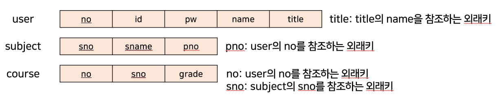

# design_pattern_console_project
- 3가지 디자인패턴을 적용한 심플 학사관리 콘솔 프로그램

### 클래스 다이어그램

### 사용한 패턴

- Strategy
  - 로그인 시 각 유저(관리자, 교수, 학생)에 맞는 메뉴 전략객체를 생성하여 display
- Template Method
  - DAO 템플릿을 추상클래스로 만들고, 이것을 상속하여 필요한 Query, PreparedStatement 바인딩값과 개별로직만 설정하여 데이터베이스 사용
- Proxy
  - 각 유저 권한에 맞는 기능만이 사용되어야 하기 때문에 보호프록시를 사용
- Singleton
  - 한 유저를 위한 콘솔 상에서 서비스 객체는 하나면 충분하기때문에 싱글턴 적용

### 기능

- 공통
  - 로그아웃, 프로그램 종료

- 관리자
  - 유저 등록
  - 유저 삭제
  - 유저 목록 보기
- 교수
  - 강의 등록
  - 강의 삭제
  - 본인 강의목록
  - 학생 점수 등록
- 학생
  - 수강신청
  - 수강삭제
  - 나의 강의

<b>※예외처리 아주미흡※<b>

### 릴레이션 스키마

- 처음 init 폴더 sql 실행 필요
- pgsql 설치 필요
- DAOTemplate 클래스 connDB() 메서드 확인 필요 (포트, 계정)

<b>users<b>
- 초기 관리자 ID: ADMIN, PW: 123 으로 로그인
  

- 밑줄: 기본키
- no: 학번(문자열)
- id, pw: 아이디, 비번
- name: 이름
- title: 권한 (관리자, 교수, 학생 중 하나)

<b>subject<b>
- sno: 과목번호
- sname: 과목이름
- pno: 담당교수

<b>course<b>
- no: 수강번호
- sno: 과목번호
- grade: 성적(A+, A 등)